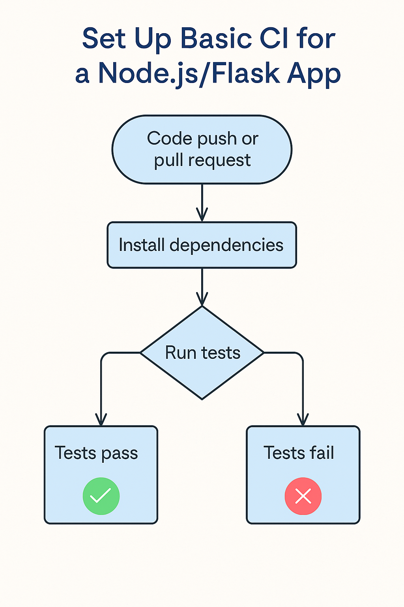
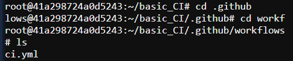
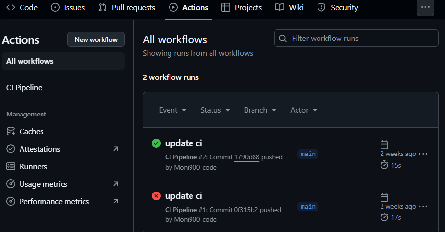
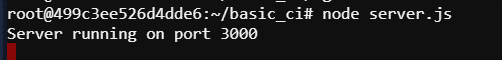
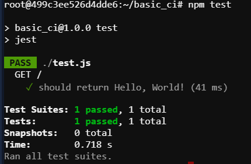

# Basic CI/CD Setup with GitHub Actions for Node.js and Flask Apps

This documentation shows how to set up **Continuous Integration (CI)** using **GitHub Actions** for both **Node.js** and **Flask** applications. Every time you `push` or open a `pull request`, tests will run automatically to ensure your application is working correctly  before merging or deploying.
The workflow is: 




---

## 1. Create Node.js Application

### 📌 Node.js App Setup


```bash
mkdir basic_CI && cd basic_CI
npm init -y
npm install express jest supertest
```
Now, create some basic files:
1. index.js (Main App File)
2. server.js (Running the Server)
3. Test.js


And add the test script in package.json file as like this:

```bash
"scripts": {
  "test": "jest"}
```
Here, **jest** use for **Node.js**


## 2. Create GitHub Actions Workflow
### 📌 Create .github/workflows/ci.yml



## 3. Push to GitHub Repository
After setting everything up, push the all code files to GitHub:
```bash
git init
git add .
git commit -m "Initial commit"
git branch -M main
git remote add origin https://github.com/your-username/your-repo.git
git push -u origin main
```

## 3. Now, Test CI/CD Functionality
Whenever new code is pushed or a pull request is made, GitHub Actions will automatically run tests for the Node.js and Flask apps.  

If the tests pass ✅, a green checkmark will appear.  

If the tests fail ❌, GitHub Actions will show a red cross.
## Github output form Actions tab: 


## Terminal Outputs are like this: 




This way, we can complete the CI-CD setup for Node.js Application.